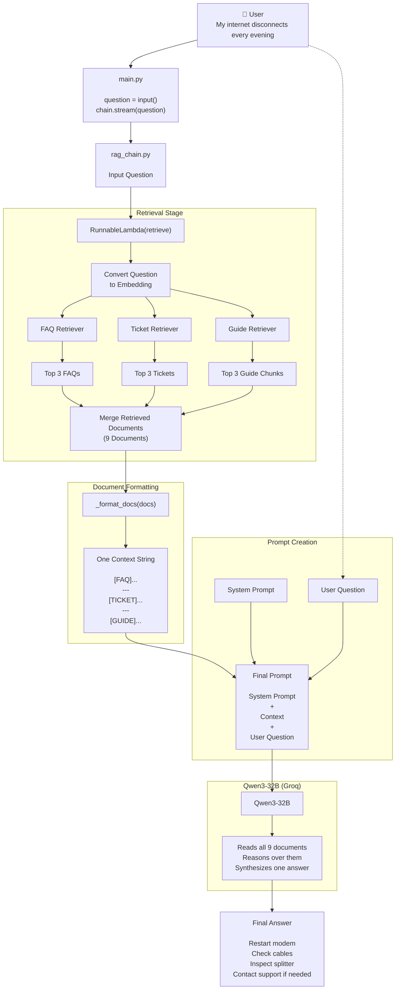

# Telecom Support Chatbot (RAG)

## Demo

<video src="resources/demo.mov" controls width="700"></video>

If your Markdown viewer doesn't render inline video (e.g. GitHub.com without the asset-upload flow), [download/view the demo directly](resources/demo.mp4).

## Retrieval Overview

```text
                    User Question
                          │
                          ▼
                  "Internet disconnects"
                          │
        ┌─────────────────┼─────────────────┐
        │                 │                 │
        ▼                 ▼                 ▼
     FAQ Search      Ticket Search     Guide Search
        │                 │                 │
      3 Docs           3 Docs           3 Docs
        │                 │                 │
        └─────────────────┼─────────────────┘
                          │
                          ▼
              Combined List (9 Documents)
                          │
                          ▼
                Format into Prompt Context
                          │
                          ▼
                      LLM (Qwen)
                          │
                          ▼
              ✅ One Final Answer
```

## Full Flow
  

